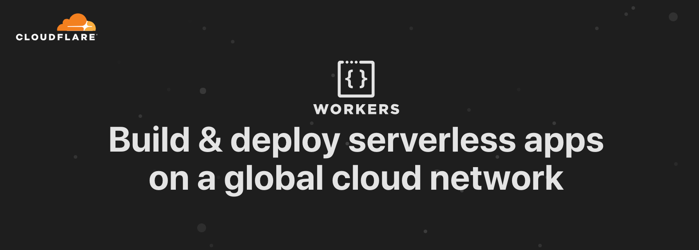

# Serverless Cloudflare Workers Blueprint 🌥👷‍♀️

A blueprint for deploying Cloudflare Workers using the [Serverless framework](https://serverless.com/).

[](http://bit.ly/cf-workers-landing)

## Setup

You'll need your Cloudflare [API keys](<https://support.cloudflare.com/hc/en-us/articles/200167836-Where-do-I-find-my-Cloudflare-API-key->) and zone ID (found on the Cloudflare Dashboard for your site) in order to deploy our Worker script from the command-line.

Below is a detailed description of each key/value pair in `.env` that should be populated before deploying your site:

```
# Your Cloudflare account id, available on the Cloudflare Dashboard
CLOUDFLARE_ACCOUNT_ID=""

# Your Cloudflare account email
CLOUDFLARE_AUTH_EMAIL=""

# Your Cloudflare auth key, available on your Cloudflare profile page
CLOUDFLARE_AUTH_KEY=""

# Your Cloudflare zone id, available on the Cloudflare Dashboard
CLOUDFLARE_ZONE_ID=""

# The route pattern for serving your Worker
WORKER_ROUTE="serverless-worker.signalnerve.com/*"
```

Given these keys, make a file called [`.env`](https://github.com/signalnerve/serverless-workers-blueprint/blob/master/.env), using [`.env.example`](https://github.com/signalnerve/serverless-workers-blueprint/blob/master/.env) as a reference:

```
cp .env.example .env
```

## Development

Serverless:

```
npm install -g serverless
npm install
```

Deploy your worker to your Cloudflare account:

```
serverless deploy
```

Go to your configured URL to confirm that your website is being served with Cloudflare Workers!

